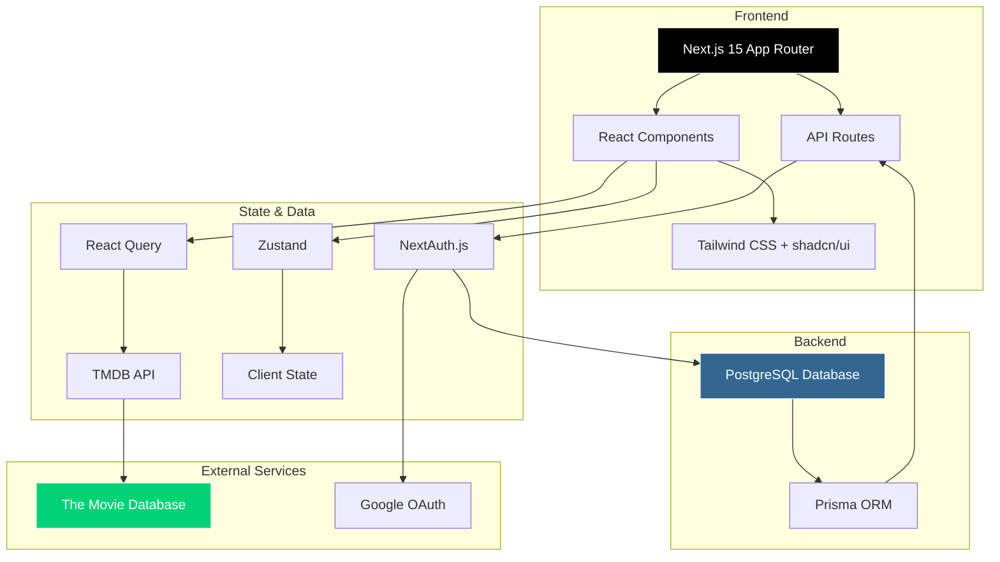
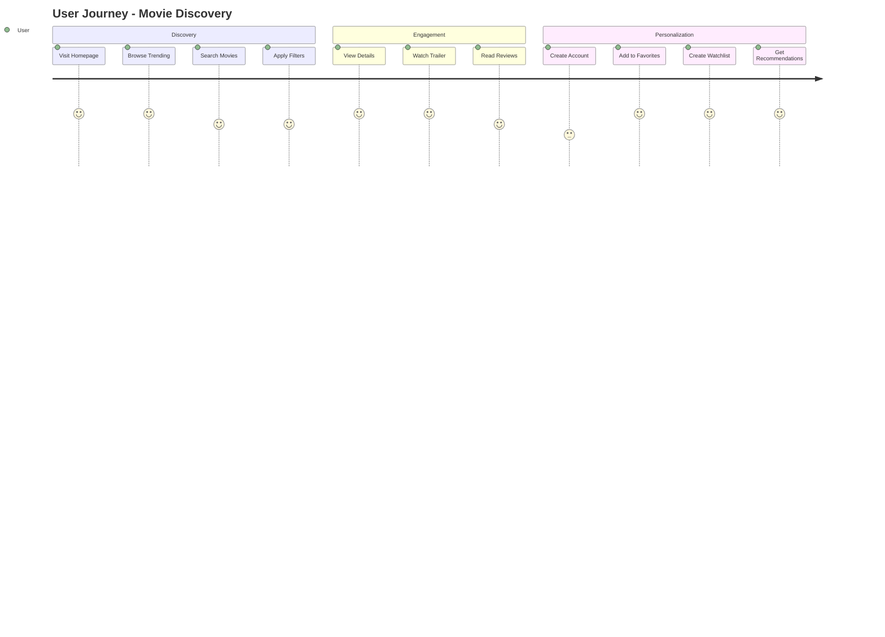

# 🎬 MovieFlix - A Movie Recommendation App

A modern movie discovery platform built with Next.js 15, featuring real-time search, advanced filtering, and personalized watchlists. Discover your next favorite movie with our intuitive interface powered by TMDB API.


## ✨ Features

- 🔍 **Real-time Search** - Instant movie search with debounced input
- 🎯 **Advanced Filters** - Filter by genre, year, rating, and sort options
- 🎬 **Movie Details** - Comprehensive information including cast, crew, and similar movies
- ❤️ **Favorites & Watchlist** - Save movies to your personal collections
- 🔐 **Authentication** - Secure login with Google OAuth or email/password
- 📱 **Responsive Design** - Seamless experience across all devices
- 🌙 **Dark Theme** - Elegant dark mode for comfortable viewing
- ⚡ **Optimized Performance** - Fast loading with image optimization and caching

## 🏗️ Architecture



## 🛠️ Tech Stack

- **Framework**: [Next.js 15](https://nextjs.org/) with App Router
- **Language**: [TypeScript](https://www.typescriptlang.org/)
- **Styling**: [Tailwind CSS](https://tailwindcss.com/) + [shadcn/ui](https://ui.shadcn.com/)
- **Database**: [PostgreSQL](https://www.postgresql.org/) with [Prisma](https://www.prisma.io/)
- **Authentication**: [NextAuth.js](https://next-auth.js.org/)
- **State Management**: [Zustand](https://zustand-demo.pmnd.rs/)
- **Data Fetching**: [React Query](https://tanstack.com/query)
- **Deployment**: [Netlify](https://netlify.com/) + [Supabase](https://supabase.com/)

## 🚀 Getting Started

### Prerequisites

- Node.js 18+ and pnpm
- TMDB API key from [themoviedb.org](https://www.themoviedb.org/settings/api)
- PostgreSQL database (or Supabase account)
- Google OAuth credentials (optional)

### Installation

1. **Clone the repository**
   ```bash
   git clone https://github.com/yourusername/movieflix.git
   cd movieflix
   ```

2. **Install dependencies**
   ```bash
   pnpm install
   ```

3. **Set up environment variables**
   ```bash
   cp .env.example .env.local
   ```
   
   Update `.env.local` with your credentials:
   ```env
   # TMDB API
   NEXT_PUBLIC_TMDB_API_KEY=your_tmdb_api_key
   
   # Database
   DATABASE_URL=your_database_url
   DIRECT_URL=your_direct_database_url
   
   # NextAuth
   NEXTAUTH_URL=http://localhost:3000
   NEXTAUTH_SECRET=your_secret_key
   
   # Google OAuth (optional)
   GOOGLE_CLIENT_ID=your_google_client_id
   GOOGLE_CLIENT_SECRET=your_google_client_secret
   ```

4. **Set up the database**
   ```bash
   pnpm prisma generate
   pnpm prisma db push
   ```

5. **Run the development server**
   ```bash
   pnpm dev
   ```

   Open [http://localhost:3000](http://localhost:3000) to see the app.

## 📝 Design Thinking

### User Journey


### Component Architecture
- **Atomic Design**: Small, reusable components built with shadcn/ui
- **Container/Presenter Pattern**: Separation of logic and presentation
- **Custom Hooks**: Encapsulated business logic for reusability
- **Error Boundaries**: Graceful error handling throughout the app

## 📁 Project Structure

```
movieflix/
├── src/
│   ├── app/              # Next.js app router pages
│   ├── components/       # React components
│   │   ├── movies/      # Movie-related components
│   │   ├── search/      # Search components
│   │   ├── layout/      # Layout components
│   │   └── ui/          # shadcn/ui components
│   ├── lib/             # Utilities and configurations
│   │   ├── api/         # API service layer
│   │   ├── auth/        # Authentication config
│   │   └── utils/       # Helper functions
│   ├── store/           # Zustand state management
│   ├── types/           # TypeScript type definitions
│   └── hooks/           # Custom React hooks
├── prisma/              # Database schema
├── public/              # Static assets
└── tests/               # Test files
```

## 🧪 Testing

```bash
# Run unit tests
pnpm test

# Run tests in watch mode
pnpm test:watch

# Generate coverage report
pnpm test:coverage
```

## 📦 Deployment

### Deploy to Netlify

1. **Push to GitHub**
   ```bash
   git add .
   git commit -m "Initial commit"
   git push origin main
   ```

2. **Import to Netlify**
   - Connect your GitHub repository
   - Configure environment variables
   - Deploy!

### Database Setup (Supabase)

1. Create a project at [supabase.com](https://supabase.com)
2. Copy the database URL
3. Update your environment variables
4. Run migrations: `pnpm prisma migrate deploy`

## 🤝 Contributing

1. Fork the repository
2. Create your feature branch (`git checkout -b feature/amazing-feature`)
3. Commit your changes (`git commit -m 'Add some amazing feature'`)
4. Push to the branch (`git push origin feature/amazing-feature`)
5. Open a Pull Request

## 📄 License

This project is licensed under the MIT License - see the [LICENSE](LICENSE) file for details.

## 🙏 Acknowledgments

- [TMDB](https://www.themoviedb.org/) for the comprehensive movie database API
- [shadcn/ui](https://ui.shadcn.com/) for the beautiful component library
- [Netlify](https://netlify.com/) for the seamless deployment platform
- [Supabase](https://supabase.com/) for the PostgreSQL database hosting

---

Built with ❤️ by Adrian Kiplimo